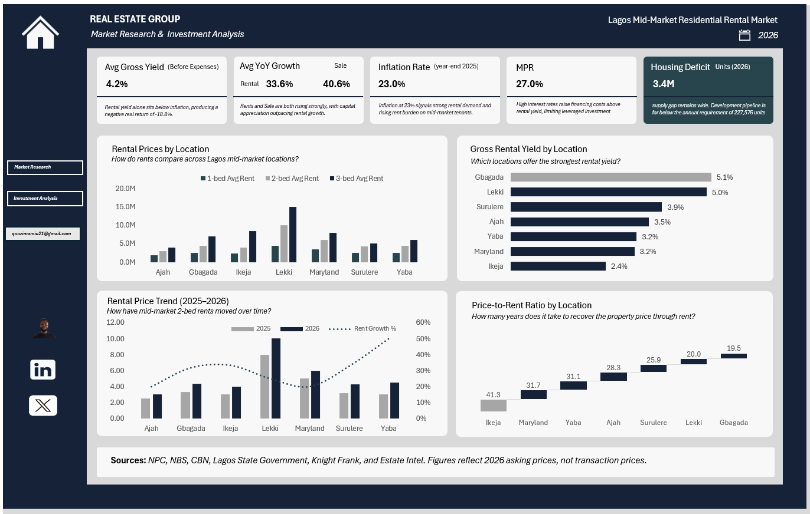

# Lagos Real Estate Market Analysis

### Rental Yields, Property Prices, Housing Supply & Investment Risk Analysis in Lagos

A data-driven investment research assessment of the Lagos mid-market residential rental market, covering 7 locations, 170 source data points, rental and property price trends, gross rental yield analysis, price-to-rent relationships, macroeconomic conditions, and investment risk assessment.

---

## Dashboard Preview

---

## Overview

This project evaluates the investment characteristics of the Lagos mid-market residential rental market across seven locations, with 170 source data points covering rental prices, property sale prices, housing supply indicators, macroeconomic conditions, and location-level investment metrics.

The objective was not simply to report market prices, but to determine whether the segment warrants further investment investigation and to identify the evidence required before capital commitment.

The analysis examines:

- Rental prices across 7 Lagos locations
- Property sale prices and price-to-rent relationships
- Rental growth and property-price growth
- Gross rental yield by location and unit type
- Housing demand and supply dynamics
- Macroeconomic conditions (inflation, MPR, GDP, exchange rate)
- Financing conditions and cost of capital
- Location-level investment performance variation
- Investment risks and data limitations
- Due diligence requirements before capital commitment

---

## Research Questions

The analysis was designed to answer five core investment questions:

1. How strong is underlying residential demand in Lagos?
2. Is housing supply sufficient relative to reported demand?
3. How have rental and property prices changed?
4. Do rental yields justify current property prices?
5. What risks and uncertainties should an investor consider before entering the market?

---

## Dataset & Scope

The analysis covers 7 Lagos locations across the mid-market residential rental segment. The dataset contains location-level rental prices, property sale prices, housing supply indicators, macroeconomic data, and regulatory information.

### Scope of Analysis

| Area | Coverage |
|------|----------|
| Locations | 7 (Yaba, Surulere, Gbagada, Ikeja, Lekki, Ajah, Maryland) |
| Unit Types | 1-bedroom, 2-bedroom, 3-bedroom |
| Source Data Points | 170 |
| Cleaned Data Points | 166 |
| Analysis Period | 2024–2026 (primary: 2025–2026) |
| Primary Outcome Metrics | Gross yield, price-to-rent, rental growth, price growth |
| Supply Indicators | Housing deficit, annual requirement, development pipeline |
| Macroeconomic Indicators | Inflation, MPR, GDP growth, exchange rate |
| Sources | NPC, NBS, CBN, Lagos State, Knight Frank, Estate Intel, Zikan, Edala Research |

---

## Core Investment Metrics

| Metric | Definition |
|--------|------------|
| **Gross Rental Yield** | Annual rental income ÷ property sale price |
| **Price-to-Rent Ratio** | Years of gross rental income required to equal property value |
| **Rental Growth (YoY)** | Annual percentage change in rental prices |
| **Property-Price Growth (YoY)** | Annual percentage change in sale prices |
| **Yield Compression** | Gap between property-price growth and rental growth |
| **Real Yield Approximation** | Gross yield less inflation (rough comparison, not formal real return) |
| **Pipeline Coverage** | Development pipeline relative to annual housing requirement |

These metrics are evaluated together because no single indicator provides a complete view of investment attractiveness.

---

## Methodology

### Step 1 — Data Collection

Rental prices, property prices, housing indicators, macroeconomic indicators, and location-level market information were collected from multiple credible sources.

### Step 2 — Data Cleaning

Data was reviewed for missing values, inconsistent observations, outliers, unverifiable property prices, definitional differences, and source limitations.

- A Maryland 1-bedroom sale-price observation was excluded because the reported value could not be sufficiently verified.
- A Gbagada 1-bedroom yield of 11.90% was treated cautiously as an outlier.

### Step 3 — Market Analysis

The analysis calculated and compared average rental prices, rental growth, property-price growth, gross rental yield, price-to-rent relationships, and location-level performance.

### Step 4 — Macroeconomic Assessment

The investment environment was assessed against inflation, monetary policy, GDP growth, exchange-rate conditions, and mortgage-market conditions.

### Step 5 — Investment Assessment

The evidence was considered alongside market risks and data limitations to determine whether the segment should be investigated further.

---

## Key Findings

### 1. Structural Demand Is Strong

| Indicator | Value |
|-----------|-------|
| Reported renter share | 70–80% |
| Population growth | 3.8% annually |
| Estimated new residents | 600,000 annually |
| Estimated annual housing requirement | 227,576 units |
| Identified development pipeline | 34,800 units |
| Pipeline coverage | ~15% of one year's estimated requirement |

### 2. Prices Are Growing Faster Than Rents

| Metric | Value |
|--------|-------|
| Average rent growth (2025–2026) | +33.6% |
| Average property-price growth (2025–2026) | +40.6% |
| Growth gap | 7.0 percentage points |

This indicates potential yield compression as capital values rise faster than rental income.

### 3. Gross Rental Yields Are Materially Below Inflation

| Metric | Value |
|--------|-------|
| Average gross rental yield | 4.2% |
| Inflation (2025) | 23.0% |
| Difference | 18.8 percentage points |

Rental income alone does not preserve purchasing power. The investment case depends on capital appreciation.

### 4. Location-Level Economics Vary Considerably

| Location | Gross Yield | Price-to-Rent |
|----------|-------------|---------------|
| Gbagada | 5.12% | 19.5 years |
| Lekki | 5.00% | 20.0 years |
| Surulere | 3.86% | 25.9 years |
| Ajah | 3.53% | 28.3 years |
| Yaba | 3.21% | 31.1 years |
| Maryland | 3.16% | 31.7 years |
| Ikeja | 2.42% | 41.3 years |

### 5. Financing Environment Is Challenging

| Metric | Value |
|--------|-------|
| Monetary Policy Rate (MPR, 2025) | 27.0% |
| Average gross rental yield | 4.2% |
| Difference | 22.8 percentage points |

MPR is a policy benchmark, not the actual borrowing rate, but it signals a high-interest-rate environment that materially affects debt-financed acquisitions.

---

## Rental Prices by Location

### 2026 Indicative Annual Asking Rents — 2-Bedroom Units

| Location | Rent |
|----------|------|
| Lekki | ₦10.0M |
| Maryland | ₦6.0M |
| Yaba | ₦4.5M |
| Gbagada | ₦4.35M |
| Surulere | ₦4.25M |
| Ikeja | ₦4.0M |
| Ajah | ₦3.0M |

Lekki records the highest observed annual rent in the dataset at approximately ₦10 million, while Ajah records the lowest at approximately ₦3 million.

This variation demonstrates that Lagos should not be treated as a single homogeneous residential investment market.

---

## Rental vs Property-Price Growth

Property prices outpaced rents in every location analysed, producing consistent yield compression across the segment.

---

## Yield vs Inflation

The average gross rental yield of 4.2% is 18.8 percentage points below the reported inflation rate of 23.0%. This highlights the substantial gap between nominal rental income yield and the prevailing inflation environment.

---

## Macroeconomic Environment

### 2025 Year-End Indicators

| Indicator | Value |
|-----------|-------|
| Inflation | 23.0% |
| Monetary Policy Rate (MPR) | 27.0% |
| GDP Growth | 3.87% |
| Exchange Rate | ₦1,429/$ |

Inflation creates pressure on both household purchasing power and property operating costs. MPR signals a challenging financing environment. Exchange-rate volatility affects construction and operating costs.

---

## Investment Risks

### Priority Risks

| # | Risk | Evidence |
|---|------|----------|
| 1 | Inflationary erosion of rental returns | Gross yield 4.2% vs inflation 23.0% |
| 2 | Financing cost pressure | MPR 27.0% vs gross yield 4.2% |
| 3 | Yield compression | Price growth 40.6% vs rent growth 33.6% |
| 4 | Supply data inconsistency | Differing definitions across sources |
| 5 | Asking-price overstatement | Listing prices ≠ transaction prices |

### Secondary Risks

- Currency and macroeconomic volatility
- Location-specific execution risk
- Exit liquidity constraints
- Regulatory and tax uncertainty
- Data quality limitations

---

## Investment Assessment

### Assessment: Explore with Caution

The evidence supports further investigation but does not provide sufficient confidence for immediate capital commitment.

**Supporting evidence:**

- Structural housing shortage (3.4M units)
- Strong demand indicators (70–80% renter share)
- Strong rent and price growth
- Location-level yield variation

**Key uncertainties:**

- Gross yield 4.2% below inflation
- MPR 27.0% constrains leveraged acquisitions
- Asking prices, not transaction prices
- Supply data may use different definitions

---

## Due Diligence Plan

Before capital commitment, the following should be validated:

### 1. Standardise and Validate Supply Data
Reconcile housing deficit, annual requirement, and pipeline figures using consistent definitions and periods.

### 2. Verify Transaction-Level Pricing
Compare asking prices with completed transaction prices to confirm achievable entry and exit values.

### 3. Confirm Property-Level Economics
Validate achievable rents, occupancy levels, operating expenses, and service charges.

### 4. Obtain Actual Lending Terms
Confirm interest rates, loan-to-value, tenor, fees, repayment structure, and debt-service requirements.

### 5. Stress-Test Returns
Model vacancy, rent growth, financing costs, and capital appreciation under multiple scenarios.

### 6. Compare Capital Structures
Assess equity, debt, and joint-venture structures.

### 7. Test Exit Assumptions
Evaluate whether observed capital appreciation is achievable at exit.

---

## Limitations

| Limitation | Detail |
|------------|--------|
| Asking prices, not transaction prices | Yields may overstate actual returns |
| Limited location-level observations | Some locations have fewer data points |
| Data gaps | Maryland 1-bed sale price excluded |
| Outliers | Gbagada 1-bed yield treated cautiously |
| Macro lag | Inflation and MPR figures from 2025 |
| Single-source locations | Reduced triangulation for some data points |

---

## Sources

- **Nigeria Property Centre (NPC)** — location-level asking rents and sale prices
- **National Bureau of Statistics (NBS)** — inflation, GDP, labour indicators
- **Central Bank of Nigeria (CBN)** — monetary policy rate, exchange rate
- **Lagos State Government** and **LASRERA** — housing policy and regulation
- **Knight Frank** — Lagos residential market commentary
- **Estate Intel** — development pipeline and construction activity
- **BusinessDay**, **TheCable** — market reporting and analysis
- **Zikan Properties** — 2024 baseline and 2026 rent comparison data
- **Edala Research** — 2025 rental averages via Guardian and Nairametrics

---

## Final Summary of Key Metrics

| Metric | Value |
|--------|-------|
| Locations Analysed | 7 |
| Source Data Points | 170 |
| Analysis Period | 2024–2026 |
| Average Gross Rental Yield | 4.2% |
| Yield Range | 2.42% – 5.12% |
| Average Rent Growth | +33.6% |
| Average Price Growth | +40.6% |
| Growth Gap | 7.0 pp |
| Inflation (2025) | 23.0% |
| MPR (2025) | 27.0% |
| GDP Growth (2025) | 3.87% |
| Housing Deficit | 3.4M units |
| Annual Housing Requirement | 227,576 units |
| Development Pipeline | 34,800 units |
| **Assessment** | **Explore with Caution** |

---

## 📖 Read the Full Analysis

The complete write-up — including methodology, findings, risk analysis, and investment assessment — is available on Medium:

**[Lagos Real Estate Market 2026: Rental Yields, Property Prices, Housing Supply & Investment Risks →](https://medium.com/@qoozimjamiu21/lagos-real-estate-market-2026-rental-yields-property-prices-housing-supply-investment-risks-0fef6b7485df?sharedUserId=qoozimjamiu21)**

---

## Data Note

Market figures should be interpreted within the limitations of their respective sources. Asking prices should not be treated as equivalent to completed transaction prices. Market-wide housing indicators may not be directly comparable where definitions or reporting periods differ.
